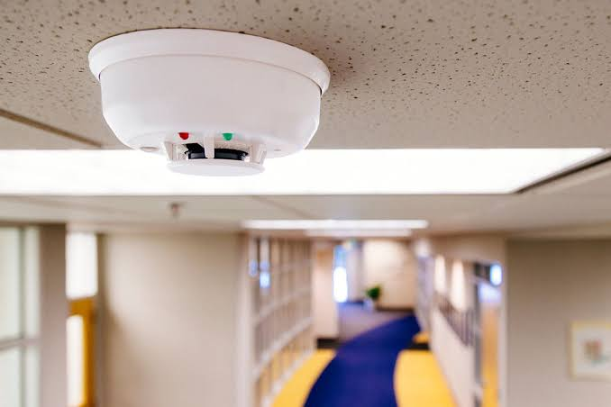
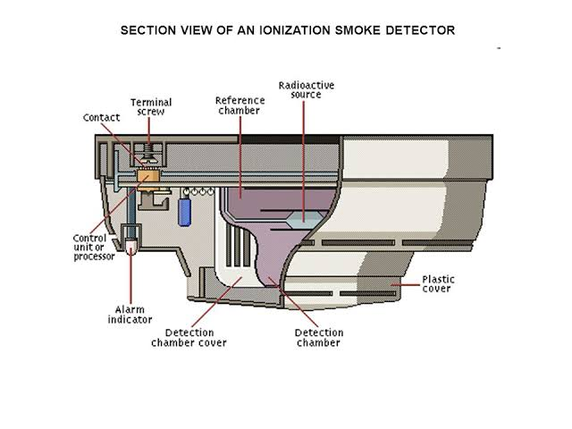

### Theory
A smoke detector is a device that senses smoke, typically as an indicator of fire. Household smoke detectors, also known as smoke alarms, generally issue an audible or visual alarm from the detector itself or several detectors if there are multiple devices interlinked. Smoke alarms detect particles in the air.  Smoke detectors use a photoelectric beam between a receiving element and light source. If smoke obscures the beam an alarm is sounded. There are also refraction-type models that measure the light changes that occur within the instrument when smoke particles enter it. Area smoke detectors are generally installed in buildings and accommodation areas. Where this is not practical—say in the galley area—other types of fire detector should be used. Actuation of a single smoke detector will initiate a fire alarm. If additional detectors sound an alarm, the equipment in the area of the fire and HVAC systems will be shut down. 

### Types of Smoke Detectors
There are two types of smoke detector.
1. Ionization detectors
2. Photoelectric detectors

##### Ionization detectors
First, there are ionization detectors. These use a small bit of safely shielded radioactive material that electrically charges, or ionizes, the air molecules between two metal plates. This produces a small electric current flowing from one plate to the other in the air. When particles enter the chamber, they attract the ions and carry them away, reducing the current. When the number of particles entering the chamber is enough to reduce that current below a certain amount, the device will register those particles as smoke and the alarm will sound. (And about that radioactive material? Most of its radiation is blocked inside the device, and even then, the radiation levels in the device are much lower than the natural background radiation to which we are exposed every day.)

##### Photoelectric detectors
The other type of commonly used detection technology is called photoelectric. This technology works by detecting light that is reflected off particles from a light beam inside the sensing chamber. When no particles are present in the sensing chamber, the light from the beam does not strike the light detector, indicating all clear. When there are particles present and the amount of light registered by the light detector reaches a certain threshold level, the alarm sounds.  
The appropriate type of smoke detector must be installed to avoid them being disabled because dust or condensation sets them off falsely. A more appropriate detector, such as UV or infrared system which is not triggered by particles, should be installed if that is the case.

### Advantages

The most obvious advantage of having a smoke alarm system installed in your home or building is that it gives you peace of mind. Not only does it provide early warning in the event of a fire, but it also allows you to take appropriate action before it’s too late. This could save lives—both yours and anyone else who might be inside the building at the time. 
Smoke detector systems are also relatively simple to install and maintain. Many modern systems come with wireless technology, making them easy to install and configure without running any wires through walls or ceilings. Once installed, they are typically low-maintenance, although they should be tested regularly according to manufacturer instructions. 

### Disadvantages 

The main disadvantage of installing a smoke detector system is the cost involved. Depending on the plan selected, installation costs can range from hundreds to thousands of dollars—and this doesn’t include any routine maintenance costs such as testing or replacing batteries periodically. Additionally, false alarms caused by faulty sensors can be costly (in terms of fines) and frustrating for homeowners/building occupants if they occur too often. 

### Applications:

- Industry
- Commercial activities
- Public and Private buildings
- Home environments